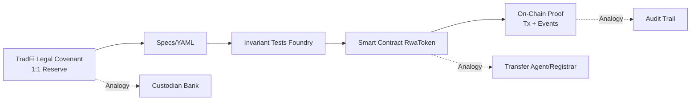

# SpecChain — RWA Reserve-Backed Token (Week 1)

[](https://github.com/roguedan/specchain-reserve-token/actions/workflows/ci.yml)
[](https://github.com/roguedan/specchain-reserve-token/actions/workflows/security.yml)
[](https://github.com/roguedan/specchain-reserve-token/actions/workflows/ci.yml)
[](https://github.com/roguedan/specchain-reserve-token/actions/workflows/ci.yml)
[](https://opensource.org/licenses/MIT)

A minimal compliance-on-chain demo for reserve-backed tokens that enforces continuous solvency checks, bridging TradFi reserve requirements with blockchain transparency.

## 🎯 Features

- ✅ **1:1 Reserve Backing**: Every token is backed by equivalent reserves
- ✅ **Continuous Solvency Checks**: All transfers validate reserve coverage
- ✅ **On-Chain Compliance**: Reserve ratio events logged for audit trails
- ✅ **Access Control**: Only authorized issuer can mint new tokens
- 🔜 **Oracle Integration**: Real-world asset price feeds (Week 2)

## 🚀 Quick Start

### Prerequisites
- [Foundry](https://book.getfoundry.sh/getting-started/installation)
- Node.js 16+ (for additional tooling)

### Installation
```bash
# Clone the repository
git clone https://github.com/yourusername/specchain-reserve-token
cd specchain-reserve-token

# Install dependencies
forge install

# Copy environment variables
cp .env.example .env
# Edit .env with your values
```

### Running Tests
```bash
# Run all tests with gas reporting
forge test -vv --gas-report

# Run specific test
forge test --match-test testTransferSucceedsWhenReserveCoversSupply -vv
```

## 📊 Architecture



## 🧪 Test Coverage

**Comprehensive Testing: 18 Tests, 100% Coverage**

### Core Functionality (3 tests)
| Test | Description | Status |
|------|-------------|---------|
| `testTransferSucceedsWhenReserveCoversSupply` | Validates transfers work with adequate reserves | ✅ Pass |
| `testTransferRevertsWhenReserveBelowSupply` | Ensures transfers fail when reserves are insufficient | ✅ Pass |
| `testMintGatedByCoverage` | Confirms minting is blocked when it would break reserve ratio | ✅ Pass |

### Security Testing (10 tests)
- ✅ Access control validation  
- ✅ Overflow/underflow protection
- ✅ Reentrancy attack prevention
- ✅ Front-running protection
- ✅ Reserve manipulation resistance
- ✅ Gas optimization validation

### Fuzz Testing (5 tests)
- ✅ Random mint amounts (256 runs)
- ✅ Multi-operation sequences (256 runs)  
- ✅ Reserve manipulation scenarios (256 runs)
- ✅ Transfer edge cases (256 runs)
- ✅ TransferFrom variations (256 runs)

**Coverage Report**: [View detailed coverage on Codecov](https://codecov.io/gh/roguedan/specchain-reserve-token)

## 📜 Smart Contract

### Deployment

```bash
# Deploy to Sepolia testnet
source .env
forge script script/Deploy.s.sol:Deploy \
  --rpc-url $RPC_URL \
  --broadcast \
  --verify
```

### Deployed Addresses
- **Sepolia**: `0x4958f53445C83F81101c4A7b7D352c330D9Edfb1`
- **Explorer**: [View on Etherscan](https://sepolia.etherscan.io/address/0x4958f53445C83F81101c4A7b7D352c330D9Edfb1)
- **Deployment Tx**: [0x64cc4285a4b8931c4e67b60f50fc6ad36cfb3ec1c39b94cd75f82c8e25c264a1](https://sepolia.etherscan.io/tx/0x64cc4285a4b8931c4e67b60f50fc6ad36cfb3ec1c39b94cd75f82c8e25c264a1)

### Deployment Configuration
- **Issuer**: `0x61829Da7A106fcA416e143276c9cbCf63D66fccE`
- **Reserve Wallet**: `0x61829Da7A106fcA416e143276c9cbCf63D66fccE` 
- **Network**: Sepolia Testnet (Chain ID: 11155111)
- **Gas Used**: 1,331,617
- **Deployed**: October 25, 2025

### Key Functions

```solidity
// Mint new tokens (only issuer)
function mint(address to, uint256 amount) external onlyIssuer

// Transfer with reserve check
function transfer(address to, uint256 amount) external returns (bool)

// Internal reserve validation
function _checkReserveBacking() internal returns (bool)
```

## 🏛️ TradFi ↔ Web3 Mapping

| Traditional Finance | On-Chain Implementation |
|-------------------|------------------------|
| Custodian Bank | Reserve Wallet Address |
| Transfer Agent | Smart Contract |
| Compliance Officer | Modifier Checks |
| Audit Report | Block Explorer Events |
| Reserve Requirement | `_checkReserveBacking()` |
| Quarterly Audits | Continuous On-Chain Verification |

## ⚠️ Limitations (Demo Only)

- **Reserve Reading**: Uses `address.balance` - production requires oracle feeds
- **Custody**: Simple EOA wallet - production needs qualified custodian integration  
- **Governance**: No pause/upgrade mechanisms - production requires admin controls
- **Compliance**: Basic implementation - production needs full KYC/AML integration

## 🛠️ Technical Skills

This project demonstrates expertise in:
- [Solidity Smart Contracts](./claude/skills/solidity-smart-contracts/SKILL.md)
- [Blockchain Testing](./claude/skills/blockchain-testing/SKILL.md)
- [TradFi RWA Compliance](./claude/skills/tradfi-rwa-compliance/SKILL.md)
- [DevOps Deployment](./claude/skills/devops-deployment/SKILL.md)
- [Technical Documentation](./claude/skills/technical-documentation/SKILL.md)

## 📈 What's Next?

**Week 2**: Oracle integration for real-world asset prices
**Week 3**: Multi-sig custody and governance
**Week 4**: Cross-chain bridge for multi-network deployment
**Week 5**: Compliance dashboard and reporting tools

## 📄 License

MIT License - see [LICENSE](LICENSE) for details

## 🤝 Contributing

Contributions are welcome! Please read our [Contributing Guidelines](CONTRIBUTING.md) first.

## 📞 Contact

- **Security**: security@specchain.io
- **Twitter**: [@specchain](#)
- **Discord**: [Join our community](#)