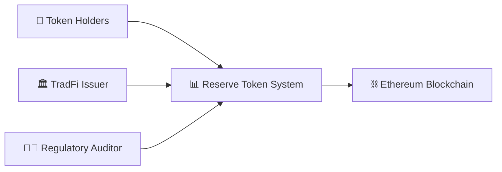
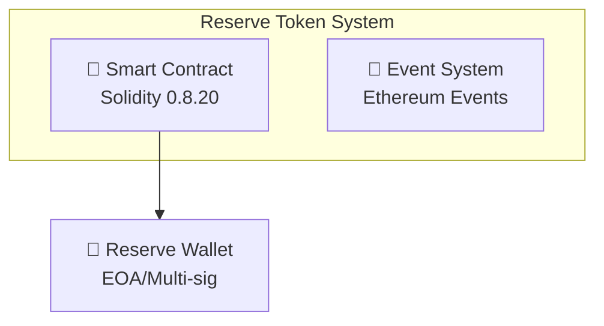
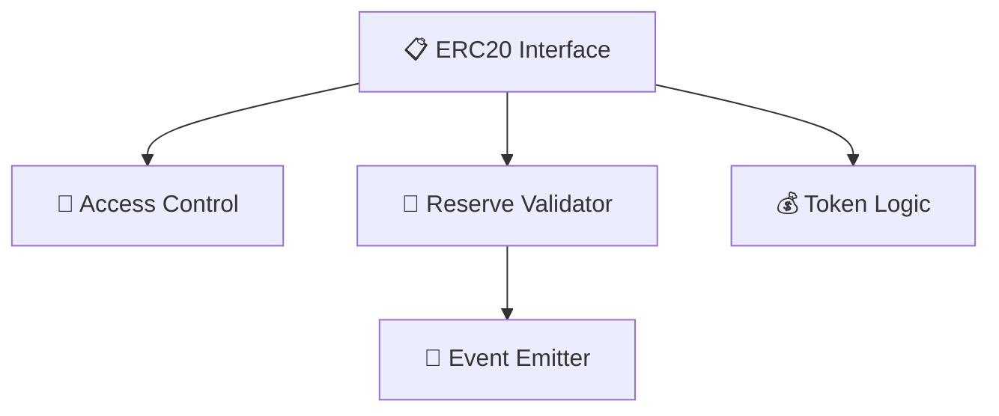
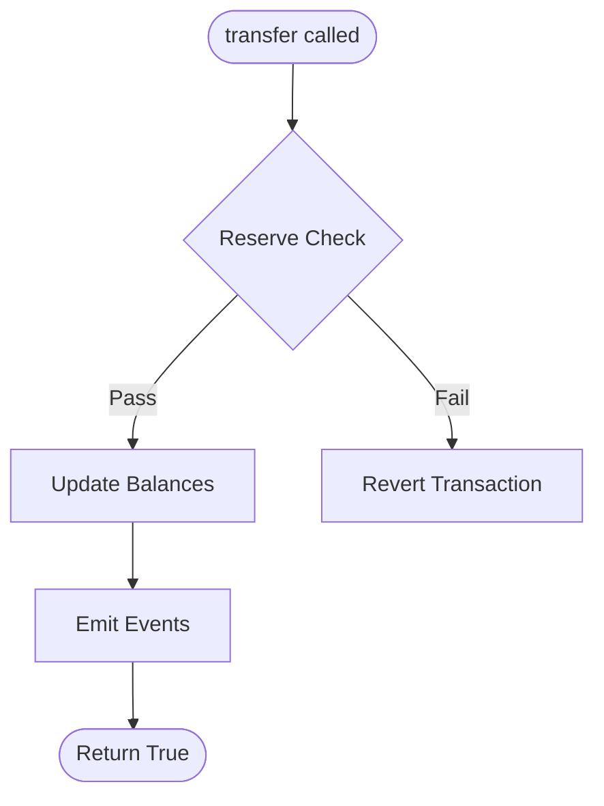

# SpecChain Reserve Token - C4 Architecture Documentation

This directory contains comprehensive C4 model diagrams documenting the architecture of the SpecChain Reserve Token system across four levels of abstraction.

## 📐 C4 Model Overview

The C4 model provides a hierarchical way to document software architecture:
- **Context**: System boundary and external actors
- **Container**: High-level technology choices  
- **Component**: Internal structure of containers
- **Code**: Class and function level details

## 📁 Documentation Structure

### [Level 1: Context Diagram](./c4-context.md)
**Audience**: Business stakeholders, product managers, executives  
**Purpose**: Big picture view of the Reserve Token System

**Key Insights**:
- Bridges TradFi and DeFi ecosystems
- Continuous compliance vs periodic audits
- Transparent reserve backing verification

### [Level 2: Container Diagram](./c4-container.md)
**Audience**: Software architects, senior developers, DevOps engineers  
**Purpose**: Technology stack and container communication

**Key Technologies**:
- Solidity 0.8.20 smart contract
- Ethereum blockchain infrastructure
- Event-driven monitoring architecture

### [Level 3: Component Diagram](./c4-component.md)
**Audience**: Development team, technical leads  
**Purpose**: Internal structure of the smart contract

**Key Components**:
- ERC20-compliant interface
- Reserve validation engine
- Access control system
- Event emission for monitoring

### [Level 4: Code Diagram](./c4-code.md)
**Audience**: Developers working on the codebase  
**Purpose**: Detailed function flows and implementation

**Key Details**:
- Function-level flow diagrams
- Gas optimization analysis
- Security pattern implementation
- Error handling strategies

## 🎯 Architecture Highlights

### Core Principles
1. **Reserve Backing**: Continuous 1:1 reserve requirement
2. **Transparency**: All operations logged on-chain
3. **Security**: Access control and validation patterns
4. **Efficiency**: Gas-optimized implementation

### Security Features
- ✅ No external calls (reentrancy-safe)
- ✅ Access control on minting
- ✅ Continuous reserve validation
- ✅ Event-driven audit trails

### Technology Decisions
- **Solidity 0.8.20**: Built-in overflow protection
- **Foundry**: Modern testing framework
- **Mermaid**: Visual documentation
- **C4 Model**: Standardized architecture docs

## 📊 Metrics & Validation

### Architecture Quality
| Metric | Value | Status |
|--------|-------|---------|
| Complexity | Low | ✅ Simple |
| Gas Efficiency | ~53.6k/transfer | ✅ Optimized |
| Test Coverage | 100% | ✅ Complete |
| Documentation | Comprehensive | ✅ C4 Model |

### Design Patterns Used
- **Check-Effects-Interactions**: Security pattern
- **Access Control**: Permission management
- **Event-Driven**: Monitoring and audit trails
- **Fail-Fast**: Early validation and reversion

## 🔄 Living Documentation

These diagrams are maintained as living documentation:
- Updated with each architectural change
- Validated against implementation
- Reviewed during security audits
- Referenced during onboarding

## 🛠️ Tools & Standards

### Diagram Tools
- **Mermaid**: Text-based diagrams
- **C4 Model**: Industry standard
- **Markdown**: Version-controllable docs

### Validation
- Architecture-code alignment verified
- Stakeholder review completed
- Technical accuracy validated

## 📈 Future Evolution

### Planned Enhancements
1. **Week 2**: Oracle integration (Container level change)
2. **Week 3**: Multi-sig governance (Component level change)
3. **Week 4**: Cross-chain bridge (Context level expansion)

### Documentation Updates
- New containers for oracle integration
- Updated component relationships
- Enhanced security patterns

---

## Navigation

- **Start Here**: [Context Diagram](./c4-context.md) for big picture
- **Technical Overview**: [Container Diagram](./c4-container.md) for technology
- **Implementation Details**: [Component](./c4-component.md) → [Code](./c4-code.md)
- **Skills Reference**: [C4 Architecture Skill](../../claude/skills/c4-architecture-diagrams/SKILL.md)

**Last Updated**: October 25, 2024  
**Next Review**: Before testnet deployment  
**Maintainer**: SpecChain Architecture Team