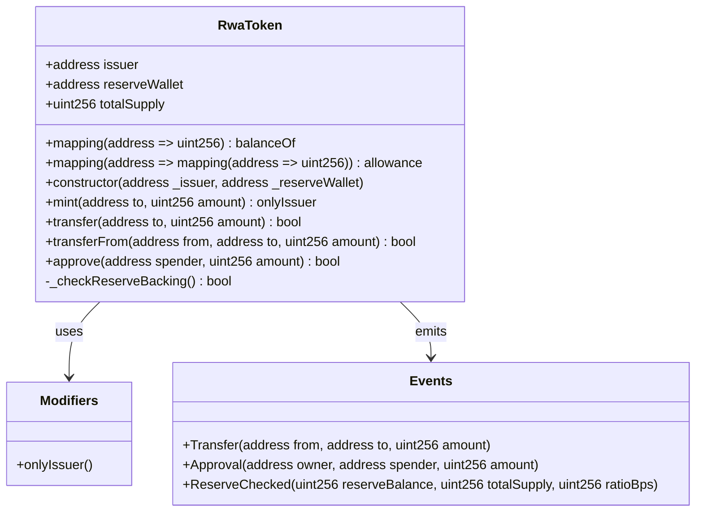
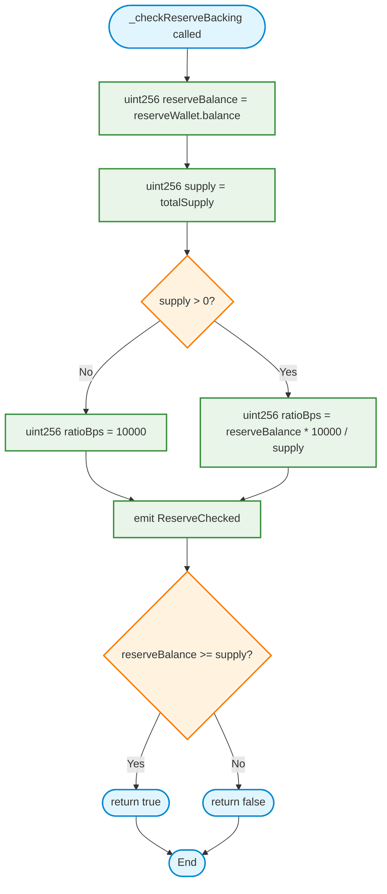
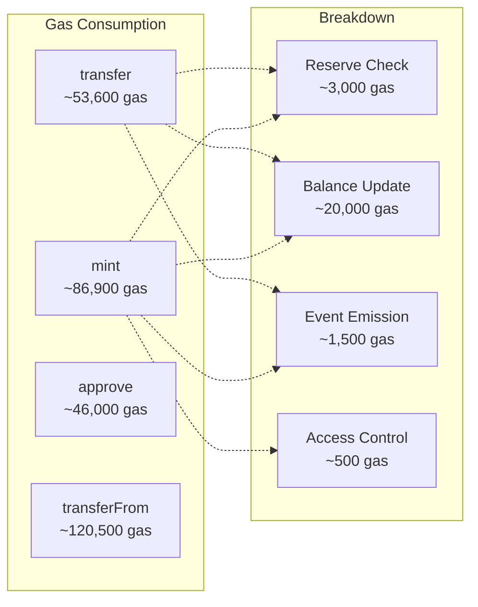
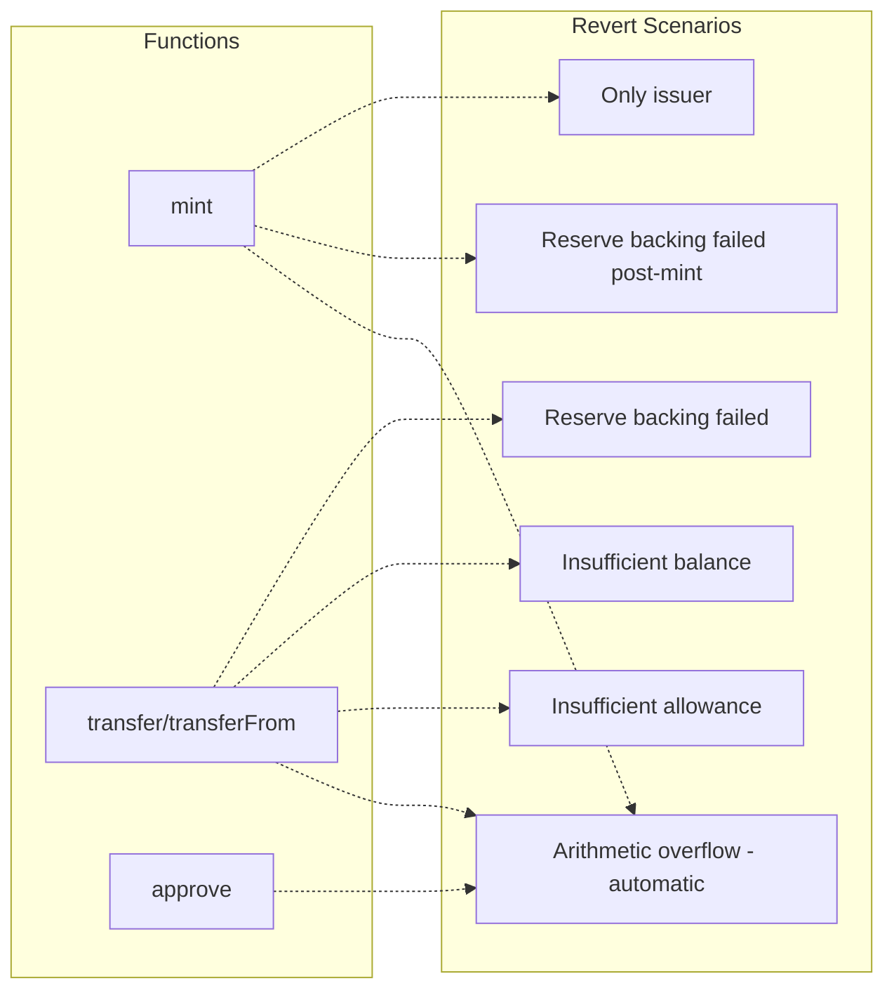

# C4 Code Diagram - SpecChain Reserve Token

**Level 4: Code Architecture**  
**Audience**: Developers working on the codebase  
**Purpose**: Show detailed function flows and class relationships

## Code Structure Overview



## Function Flow Diagrams

### 1. Transfer Function Flow

```mermaid
flowchart TD
    Start([transfer called]) --> CheckReserve{_checkReserveBacking}
    
    CheckReserve --> GetReserveBalance[reserveWallet.balance]
    GetReserveBalance --> GetSupply[totalSupply]
    GetSupply --> CalcRatio[ratioBps = reserveBalance * 10000 / supply]
    CalcRatio --> EmitReserveEvent[emit ReserveChecked]
    EmitReserveEvent --> ReserveCheck{reserveBalance >= supply?}
    
    ReserveCheck -->|No| RevertReserve[revert: Reserve backing failed]
    ReserveCheck -->|Yes| CheckBalance{balanceOf[msg.sender] >= amount?}
    
    CheckBalance -->|No| RevertBalance[revert: Insufficient balance]
    CheckBalance -->|Yes| UpdateSender[balanceOf[msg.sender] -= amount]
    
    UpdateSender --> UpdateRecipient[balanceOf[to] += amount]
    UpdateRecipient --> EmitTransfer[emit Transfer]
    EmitTransfer --> Success([return true])
    
    RevertReserve --> End([End])
    RevertBalance --> End
    Success --> End
    
    %% Styling
    classDef startEnd fill:#e1f5fe,stroke:#0288d1,stroke-width:2px
    classDef decision fill:#fff3e0,stroke:#f57c00,stroke-width:2px
    classDef process fill:#e8f5e8,stroke:#388e3c,stroke-width:2px
    classDef error fill:#ffebee,stroke:#d32f2f,stroke-width:2px
    
    class Start,End,Success startEnd
    class CheckReserve,ReserveCheck,CheckBalance decision
    class GetReserveBalance,GetSupply,CalcRatio,EmitReserveEvent,UpdateSender,UpdateRecipient,EmitTransfer process
    class RevertReserve,RevertBalance error
```

### 2. Mint Function Flow

```mermaid
flowchart TD
    Start([mint called]) --> CheckIssuer{onlyIssuer modifier}
    
    CheckIssuer -->|msg.sender != issuer| RevertAuth[revert: Only issuer]
    CheckIssuer -->|msg.sender == issuer| IncreaseSupply[totalSupply += amount]
    
    IncreaseSupply --> IncreaseBalance[balanceOf[to] += amount]
    IncreaseBalance --> PostMintCheck[_checkReserveBacking]
    
    PostMintCheck --> GetReserveBalance[reserveWallet.balance]
    GetReserveBalance --> GetNewSupply[totalSupply (updated)]
    GetNewSupply --> CalcNewRatio[ratioBps = reserveBalance * 10000 / supply]
    CalcNewRatio --> EmitReserveEvent[emit ReserveChecked]
    EmitReserveEvent --> PostMintReserveCheck{reserveBalance >= supply?}
    
    PostMintReserveCheck -->|No| RevertPostMint[revert: Reserve backing failed post-mint]
    PostMintReserveCheck -->|Yes| EmitTransfer[emit Transfer(address(0), to, amount)]
    
    EmitTransfer --> Success([mint successful])
    
    RevertAuth --> End([End])
    RevertPostMint --> End
    Success --> End
    
    %% Styling
    classDef startEnd fill:#e1f5fe,stroke:#0288d1,stroke-width:2px
    classDef decision fill:#fff3e0,stroke:#f57c00,stroke-width:2px
    classDef process fill:#e8f5e8,stroke:#388e3c,stroke-width:2px
    classDef error fill:#ffebee,stroke:#d32f2f,stroke-width:2px
    
    class Start,End,Success startEnd
    class CheckIssuer,PostMintReserveCheck decision
    class IncreaseSupply,IncreaseBalance,PostMintCheck,GetReserveBalance,GetNewSupply,CalcNewRatio,EmitReserveEvent,EmitTransfer process
    class RevertAuth,RevertPostMint error
```

### 3. Reserve Checking Algorithm



## Gas Analysis by Function

### Function Gas Costs



## Memory and Storage Layout

### Storage Slots
```solidity
// Slot 0: address issuer (20 bytes)
// Slot 1: address reserveWallet (20 bytes)  
// Slot 2: uint256 totalSupply (32 bytes)
// Slot 3+: mapping(address => uint256) balanceOf
// Slot 4+: mapping(address => mapping(address => uint256)) allowance
```

### Memory Usage Patterns
- Minimal memory allocation
- Stack-based calculations
- No dynamic arrays or complex structures

## Error Handling

### Revert Conditions


## Security Patterns Implementation

### 1. Check-Effects-Interactions Pattern
```solidity
function transfer(address to, uint256 amount) external returns (bool) {
    // CHECKS
    require(_checkReserveBacking(), "Reserve backing failed");
    require(balanceOf[msg.sender] >= amount, "Insufficient balance");
    
    // EFFECTS
    balanceOf[msg.sender] -= amount;
    balanceOf[to] += amount;
    
    // INTERACTIONS (minimal - just events)
    emit Transfer(msg.sender, to, amount);
    return true;
}
```

### 2. Access Control Pattern
```solidity
modifier onlyIssuer() {
    require(msg.sender == issuer, "Only issuer");
    _;
}

function mint(address to, uint256 amount) external onlyIssuer {
    // Implementation
}
```

### 3. Fail-Fast Validation
```solidity
function _checkReserveBacking() internal returns (bool) {
    uint256 reserveBalance = reserveWallet.balance;
    uint256 supply = totalSupply;
    
    // Immediate validation
    return reserveBalance >= supply;
}
```

## Testing Considerations

### Unit Test Coverage
- ✅ Each function path covered
- ✅ Edge cases (zero amounts, self-transfers)
- ✅ Error conditions (insufficient balance, unauthorized access)
- ✅ Gas consumption validation

### Integration Points
- Reserve wallet balance queries
- Event emission verification
- State consistency checks

## Future Enhancements

### Planned Code Changes
1. **Custom Errors**: Replace require strings
2. **Batch Operations**: Multi-transfer functions  
3. **Pause Mechanism**: Emergency stops
4. **Upgrade Patterns**: Proxy implementation

---

**Previous Level**: [Component Diagram](./c4-component.md)  
**Architecture Overview**: [C4 Documentation Index](./README.md)