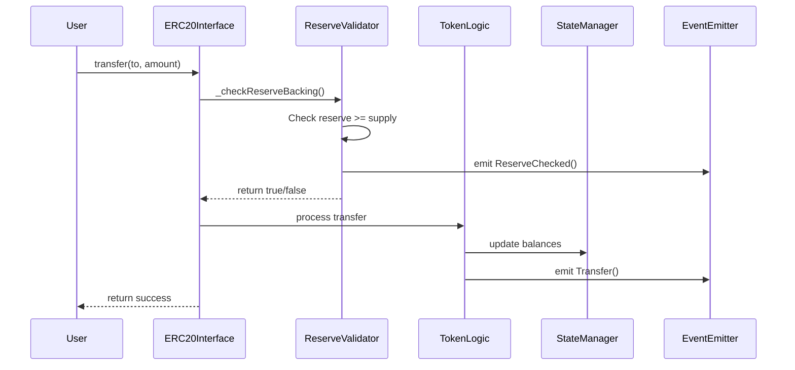
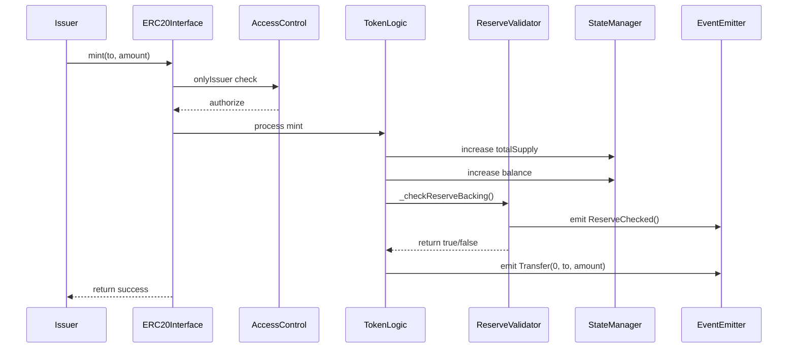

# C4 Component Diagram - SpecChain Reserve Token

**Level 3: Component Architecture**  
**Audience**: Development team, technical leads  
**Purpose**: Show internal structure of the RwaToken smart contract

## Component Diagram

```mermaid
graph TB
    %% External Interfaces
    Users[👤 Users]
    Issuer[🏛️ Issuer]
    
    %% Main Smart Contract Components
    subgraph "RwaToken Smart Contract"
        %% Interface Layer
        ERC20Interface[📋 ERC20 Interface<br/>- transfer()<br/>- transferFrom()<br/>- approve()<br/>- balanceOf()<br/>- totalSupply()]
        
        %% Core Logic Components
        AccessControl[🔐 Access Control<br/>- onlyIssuer modifier<br/>- issuer address<br/>- permission validation]
        
        ReserveValidator[🏦 Reserve Validator<br/>- _checkReserveBacking()<br/>- ratio calculation<br/>- balance queries]
        
        TokenLogic[💰 Token Logic<br/>- mint() function<br/>- balance updates<br/>- supply management]
        
        EventEmitter[📢 Event Emitter<br/>- Transfer events<br/>- Approval events<br/>- ReserveChecked events]
        
        %% Data Components
        StateManager[💾 State Manager<br/>- balanceOf mapping<br/>- allowance mapping<br/>- totalSupply variable]
        
        %% Security Layer
        ReentrancyGuard[🛡️ Security Layer<br/>- No external calls<br/>- Check-Effects-Interactions<br/>- Input validation]
    end
    
    %% External Data Sources
    ReserveWallet[(🏦 Reserve Wallet<br/>ETH Balance)]
    
    %% Internal Component Relationships
    Users --> ERC20Interface
    Issuer --> ERC20Interface
    
    ERC20Interface --> AccessControl
    ERC20Interface --> ReentrancyGuard
    ERC20Interface --> TokenLogic
    
    TokenLogic --> ReserveValidator
    TokenLogic --> StateManager
    TokenLogic --> EventEmitter
    
    ReserveValidator --> ReserveWallet
    ReserveValidator --> EventEmitter
    
    AccessControl --> TokenLogic
    ReentrancyGuard --> TokenLogic
    
    %% Styling
    classDef interface fill:#e3f2fd,stroke:#1976d2,stroke-width:2px
    classDef logic fill:#f3e5f5,stroke:#7b1fa2,stroke-width:2px
    classDef data fill:#e8f5e8,stroke:#388e3c,stroke-width:2px
    classDef security fill:#fff3e0,stroke:#f57c00,stroke-width:2px
    classDef external fill:#fce4ec,stroke:#c2185b,stroke-width:2px
    
    class ERC20Interface interface
    class TokenLogic,ReserveValidator,EventEmitter logic
    class StateManager,ReserveWallet data
    class AccessControl,ReentrancyGuard security
    class Users,Issuer external
```

## Component Details

### Interface Layer

#### ERC20 Interface
- **Purpose**: Standard token interface compliance
- **Functions**: transfer(), transferFrom(), approve(), balanceOf(), totalSupply()
- **Responsibilities**:
  - Input validation
  - Function routing
  - Return value handling
- **Dependencies**: All internal components

### Core Logic Components

#### Token Logic
- **Purpose**: Core token operations
- **Functions**: mint(), internal transfer logic
- **Responsibilities**:
  - Balance arithmetic
  - Supply management
  - Business rule enforcement
- **Dependencies**: State Manager, Reserve Validator, Event Emitter

#### Reserve Validator
- **Purpose**: Continuous solvency verification
- **Functions**: _checkReserveBacking()
- **Responsibilities**:
  - Query reserve wallet balance
  - Calculate reserve ratio
  - Enforce backing requirement
- **Algorithm**:
  ```solidity
  function _checkReserveBacking() internal returns (bool) {
      uint256 reserveBalance = reserveWallet.balance;
      uint256 supply = totalSupply;
      uint256 ratioBps = supply > 0 ? (reserveBalance * 10000) / supply : 10000;
      emit ReserveChecked(reserveBalance, supply, ratioBps);
      return reserveBalance >= supply;
  }
  ```

#### Event Emitter
- **Purpose**: Audit trail and monitoring
- **Events**: Transfer, Approval, ReserveChecked
- **Responsibilities**:
  - Log all state changes
  - Provide compliance data
  - Enable off-chain monitoring

### Security Layer

#### Access Control
- **Purpose**: Permission management
- **Pattern**: Modifier-based access control
- **Implementation**:
  ```solidity
  modifier onlyIssuer() {
      require(msg.sender == issuer, "Only issuer");
      _;
  }
  ```
- **Protected Functions**: mint()

#### Security Layer (Reentrancy Guard)
- **Purpose**: Prevent attack vectors
- **Protections**:
  - No external calls (eliminates reentrancy)
  - Check-Effects-Interactions pattern
  - Input validation
- **Note**: Built-in Solidity 0.8+ overflow protection

### Data Layer

#### State Manager
- **Purpose**: Persistent data storage
- **Data Structures**:
  - `mapping(address => uint256) public balanceOf`
  - `mapping(address => mapping(address => uint256)) public allowance`
  - `uint256 public totalSupply`
- **Optimization**: Efficient slot packing

## Component Interactions

### Transfer Flow


### Mint Flow


## Design Patterns

### 1. Check-Effects-Interactions
- **Check**: Reserve backing validation
- **Effects**: State updates (balances, supply)
- **Interactions**: Event emission (minimal gas)

### 2. Access Control
- **Pattern**: Modifier-based authorization
- **Scope**: Mint function only
- **Future**: Role-based access control

### 3. Event-Driven Architecture
- **Pattern**: Comprehensive event emission
- **Purpose**: Audit trails and monitoring
- **Events**: All state changes logged

### 4. Fail-Fast Validation
- **Pattern**: Early validation and reversion
- **Examples**: Reserve check before transfer
- **Benefit**: Gas efficiency on failures

## Gas Optimization

### Storage Optimization
- Efficient mapping usage
- No unnecessary state variables
- Packed struct potential (future)

### Computation Optimization
- Minimal arithmetic operations
- No loops or complex logic
- Simple comparison operations

### Event Optimization
- Non-indexed parameters where appropriate
- Essential data only
- Cost-effective logging

## Security Considerations

### Attack Vectors Mitigated
1. **Reentrancy**: No external calls
2. **Overflow/Underflow**: Solidity 0.8+ protection
3. **Access Control**: Modifier-based protection
4. **Front-running**: Deterministic reserve checks

### Invariants Maintained
1. **Reserve Backing**: Always reserves ≥ totalSupply
2. **Balance Conservation**: Sum of balances = totalSupply
3. **Access Control**: Only issuer can mint

---

**Previous Level**: [Container Diagram](./c4-container.md)  
**Next Level**: [Code Diagram](./c4-code.md) - Detailed function flows