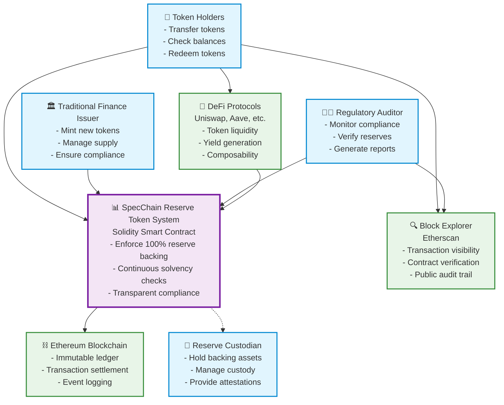

# C4 Context Diagram - SpecChain Reserve Token

**Level 1: System Context**  
**Audience**: Business stakeholders, product managers, executives  
**Purpose**: Show the big picture - how the Reserve Token System fits into the broader ecosystem

## Context Diagram

## System Scope

### In Scope ✅
- **Reserve Token Contract**: Core ERC-20 with reserve requirements
- **Reserve Validation**: Continuous backing verification
- **Compliance Events**: Transparent audit trails
- **Access Control**: Issuer-only minting privileges

### Out of Scope ❌
- **Reserve Management**: Handled by external custodian
- **Price Oracles**: Future enhancement (Week 2)
- **Governance**: Multi-sig and DAO (Week 3+)
- **Cross-chain**: Bridge functionality (Week 4+)

## Key Relationships

### Primary Flows
1. **Issuance**: TradFi Issuer → Reserve Token System → Ethereum
2. **Transfer**: Token Holders → Reserve Token System → Ethereum
3. **Monitoring**: Auditor → Block Explorer ← Ethereum
4. **Backing**: Reserve Token System ←→ Reserve Custodian

### Data Flows
- **Token Transfers**: On-chain via Ethereum
- **Reserve Checks**: Direct balance queries
- **Compliance Events**: Blockchain event logs
- **Audit Data**: Public via block explorers

## Business Context

### Problem Statement
Traditional finance relies on periodic audits (quarterly) creating windows of uncertainty. DeFi protocols need continuous verification of backing assets.

### Solution Overview
Smart contract enforces reserve requirements in real-time, providing continuous solvency verification with transparent, immutable audit trails.

### Value Proposition
- **Continuous Compliance**: Real-time verification vs quarterly audits
- **Transparency**: Public reserve ratios and transaction history
- **Composability**: Native DeFi integration capabilities
- **Efficiency**: Automated enforcement vs manual processes

## Non-Functional Requirements

### Performance
- Gas cost: <60,000 per transfer
- Transaction throughput: Limited by Ethereum (~15 TPS)

### Security
- Reserve invariant: Always maintain reserves ≥ token supply
- Access control: Only authorized issuer can mint
- Immutability: Code cannot be changed post-deployment

### Compliance
- Regulatory alignment: MiCA, Basel III equivalent
- Audit trail: All actions logged on-chain
- Transparency: Public verification of all operations

### Scalability
- Layer 2 compatible: Future Arbitrum/Optimism deployment
- Cross-chain ready: Bridge integration planned
- Batch operations: Future enhancement for institutional use

---

**Next Level**: [Container Diagram](./c4-container.md) - Technical architecture breakdown